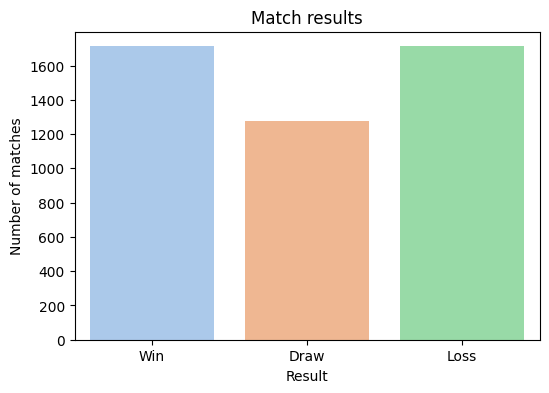
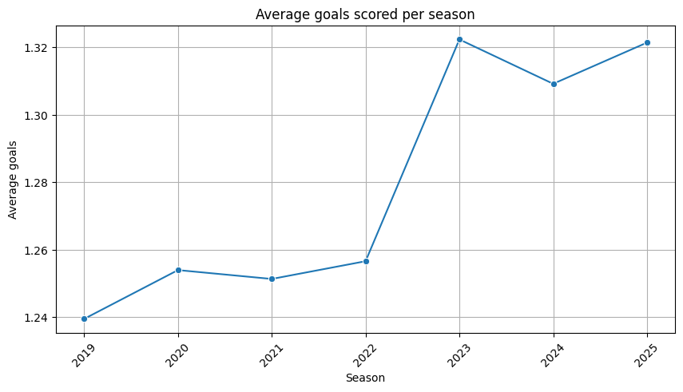
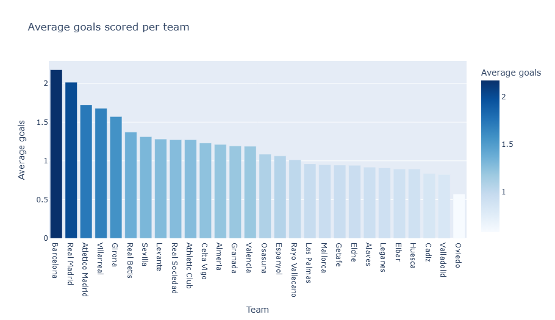

# LaLiga Matches Analysis (2019-2025)

This project is a football data analysis study (LaLiga) built with Python/Jupyter, including data cleaning, statistical analysis, classic and interactive visualizations, and KPI extraction.

## Objective

The goal is to analyze LaLiga matches across multiple seasons and answer practical business-style questions:

- Do teams perform better at home or away?
- How does goal scoring evolve over time?
- Which teams are the most offensively effective?
- Which KPIs best summarize overall performance?

## Key Results

- Home teams win **44.60%** of matches vs **28.26%** for away teams
- Average goals per match: **1.28**
- Barcelona dominates with **2.17 goals/match**, followed by Real Madrid (**2.01 goals/match**)
- Goal scoring peaked in 2023 (**1.32 goals/match**), up from **1.24** in 2019

## Sample Visualizations







## Conclusion

This analysis highlights a strong home advantage and consistent dominance from top teams like Barcelona and Real Madrid. It also reveals a slight upward trend in goal scoring over recent seasons, suggesting evolving offensive dynamics in LaLiga.

## Project Overview

- **Main notebook**: `laliga_analysis.ipynb`
- **Dataset**: `matches_full.csv`
- **Dependencies**: `requirements.txt`

The notebook is organized into:

1. Initial data loading and exploration  
2. Data cleaning and preparation  
3. Descriptive and statistical analysis  
4. Classic visualizations (Matplotlib / Seaborn)  
5. Advanced visualizations (Plotly)  
6. Relevant KPI definition

## Tech Stack

- Python
- Pandas
- Matplotlib
- Seaborn
- Plotly
- Jupyter Notebook

## Repository Structure

```text
laliga-data-analysis/
|- laliga_analysis.ipynb
|- matches_full.csv
|- requirements.txt
|- README.md
|- .gitignore
```

## Installation

### 1) Clone the repository

```bash
git clone <repository-url>
cd laliga-data-analysis
```

### 2) Create and activate a virtual environment

#### Windows (PowerShell)

```powershell
python -m venv .venv
.venv\Scripts\Activate.ps1
```

#### macOS / Linux

```bash
python3 -m venv .venv
source .venv/bin/activate
```

### 3) Install dependencies

```bash
pip install -r requirements.txt
```

### 4) Run the notebook

```bash
jupyter notebook
```

Then open `laliga_analysis.ipynb`.


## Reproducibility Notes

For stronger reproducibility:

- use a stable Python version (e.g., 3.10/3.11)
- pin package versions in `requirements.txt`
- run notebook cells in order from a clean kernel

## Data Source

LaLiga matches dataset (2019–2025)

- Source: FBref
- Available on Kaggle: https://www.kaggle.com/datasets/marcelbiezunski/laliga-matches-dataset-2019-2025-fbref?select=matches_laliga.csv


## Author

**Ferkous Adam**  
Data Analytics project.

## License

This project is licensed under the MIT License - see the `LICENSE` file for details.

---

If you find this project useful, feel free to open an issue or submit a pull request.
